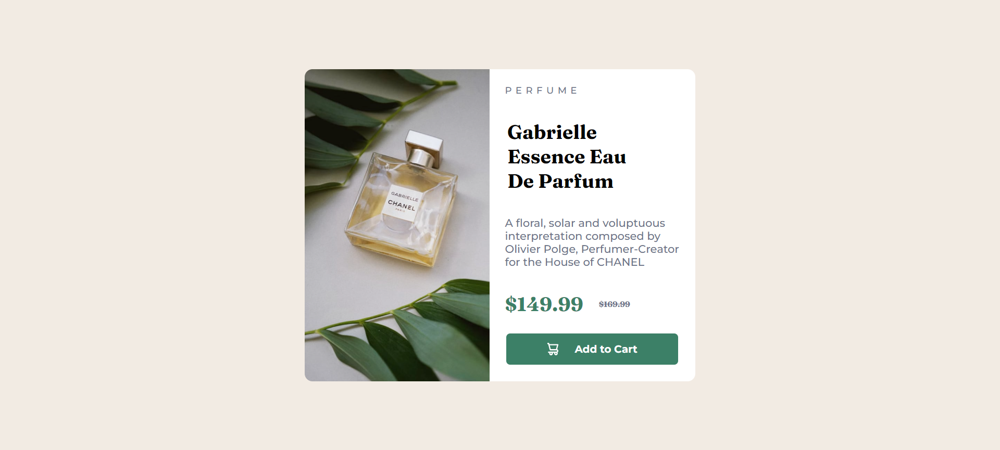

# Frontend Mentor - Product preview card component solution

This is a solution to the [Product preview card component challenge on Frontend Mentor](https://www.frontendmentor.io/challenges/product-preview-card-component-GO7UmttRfa). Frontend Mentor challenges help you improve your coding skills by building realistic projects.

## Table of contents

- [Overview](#overview)
  - [The challenge](#the-challenge)
  - [Screenshot](#screenshot)
  - [Links](#links)
- [My process](#my-process)
  - [Built with](#built-with)
  - [What I learned](#what-i-learned)
  - [Continued development](#continued-development)
  - [Useful resources](#useful-resources)
- [Author](#author)

## Overview

### The challenge

Users should be able to:

- View the optimal layout depending on their device's screen size
- See hover and focus states for interactive elements

### Screenshot



### Links

- Solution URL: [](https://your-solution-url.com)
- Live Site URL: [](https://your-live-site-url.com)

## My process

### Built with

- Flexbox

### What I learned

Learnt how hard web dev truly is even for a seemingly small project like this. Also learned a few new concepts that I still have to grasp fully. Went through a lot of challenges completing this project as well.

I'm really proud of this bit of css code. On a normal day, I wouldn't understand any of this.

```css
button {
  font-family: "Montserrat", sans-serif;
  color: white;
  background-color: hsl(158, 36%, 37%);
  border: none;
  border-radius: 5px;
  width: 220px;
  vertical-align: top;
  font-weight: bold;
  height: 40px;
  cursor: pointer;
}
```

### Continued development

Still need to work on my flexbox skills although I do believe I am becoming better. Writing HTML isn't a problem for me but CSS is (as is the case for most if not all web devs). I aim to improve my skills in CSS and hopefully I can start getting into frameworks and such.

### Useful resources

- [](https://developer.mozilla.org/en-US/) - This helped me to align the container. I really liked this pattern and will use it going forward.

## Author

- Frontend Mentor - [@daebraek](https://www.frontendmentor.io/profile/daebraek)
- Instagram - [@daebraek_uptm](https://www.instagram.com/daebraek_uptm/?hl=en)
